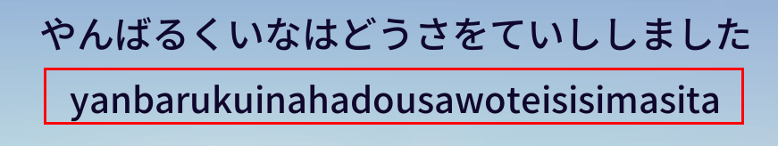
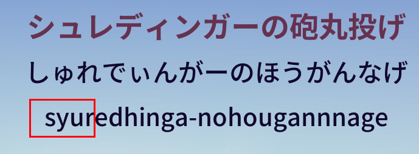
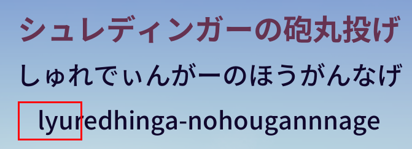
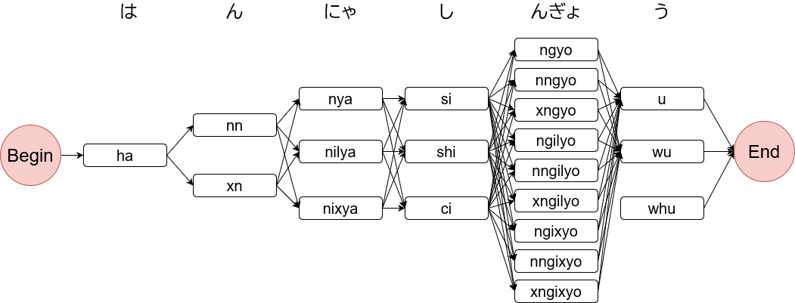

# RomanTypeParser

## 概要

ローマ字入力（日本語）のタイピングゲームを作るときに必要な複数の入力パターンに対応した判定機を作成します。

上記の画像の赤枠部分のように、複数入力パターンの作成は、データを作成するのもチェックするのも大変です。

また、開発者のタイピング関連の領域知識不足により、

- 「く」は ku、cu だけでなく qu でも打てる
- 「ん」は n、nn だけでなく xn でも打てるが、後ろに「あいうえおなにぬねのやゆよ」が接続するときや文末の「ん」は nn、xn だけを許容する
- 「しゃ」は sya、sha のほか 「し」＋「ゃ」の組み合わせで silya、sixya、shilya、shixya がある
- 「イッヌ」のように「っ」＋「なにぬねの」の時の「っ」は子音を重ねても「っ」は打てないので、「っ」は ltu、ltsu、xtu、xtsu のみでしか打てない（超マイナー）

といった不規則なパターンへの対応ができていないことがあります。

このような日本語ローマ字入力タイピングの根幹となる部分に関するデータやライブラリを提供することで、日本語ローマ字入力タイピングの開発促進と開発効率の向上を図ろうとしたものが RomanTypeParser になります。

## 構成

このプロジェクトは、.NET 6.0 で構成されています。

- JsonData:
  - romanTypingParseDictionary.json: 文章のパターンからローマ字入力での入力パターンへのマッピングを記述したファイル
- RomanTypingParser: 判定機を作成するクラスライブラリ
- ParserConsole: 文章（ひらがな、半角英数字）を入力すると区切りを表示してくれる簡易コンソールアプリ
- RomanTypingParserTest: xUnit.net で書かれたユニットテスト
  - 日本語で出る可能性のあるパターンを優先的に列挙したため、考えうるすべてのパターンを網羅していません

## 対応範囲

ひらがな、アルファベット大文字小文字、数字、句読点（「、」「。」）、長音記号です。
それ以外の記号には対応していませんが、JSON ファイルにデータを追加することで同じように利用することができると思います。

## 使い方

タイピングゲームで実際に使うのは /JsonData/romanTypingParseDictionary.json くらいです。

この JSON ファイルをデシリアライズして、`Pattern` を Key、`TypePattern` を Value となるようなデータ構造で持つことで、ひらがな、アルファベット小文字大文字、句読点（「、」「。」のみ）、長音記号（「ー」）、半角数字で書かれた文章をパースすることができるようになります。

パースの仕方は、 /RomanTypingParser/RomanTypingParser.cs の `ConstructTypeSentence` を参考にしてください。このメソッドでは、上記のような文章を `string` 型の引数として渡すと、オートマトンのようなもの（`List<List<string>>` 型）を生成します。このメソッドでは、文章が渡されると文章の先頭から 3 文字、2 文字、1 文字の長い順でマッチするようにパースを行います。

例えば、「はんにゃしんぎょう」という文字列をパースすると以下のような感じになります。

/ParserConsole/Program.cs は、コンソールアプリケーションで、対応範囲に該当する文字列でできた文章を入力すると、どのように区切られるか、どのような入力パターンがあるかを出力してくれるものです。

/RomanTypingParserTest にはユニットテストが入っております。実際に単語、文章をパースして正しい出力になるかどうかをテストしたもので、本ライブラリの正しさを一定水準で保証するものになっています。完全に正しいことを保証しているわけではない点にご留意ください。

## 参考

わたしが書いた Qiita 記事を参照してください。

[タイピングガチ勢が本格的タイピングゲーム（ローマ字入力）を実装してみた](https://qiita.com/Arthur_Lugh/items/43b61877819e402c50d6)

## ライセンス

[MIT ライセンス](https://en.wikipedia.org/wiki/MIT_License) です。

レポジトリの LICENSE をご覧ください。
